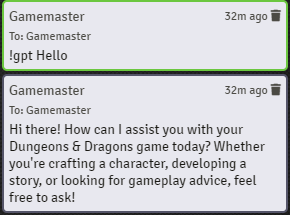
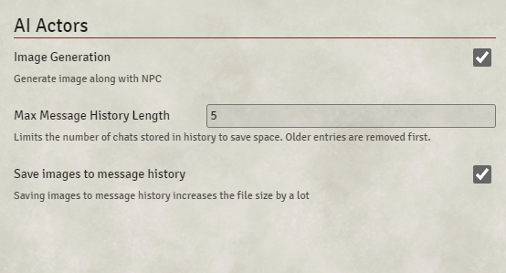

# AI Actors

AI Actors is a Foundry VTT Module that creates Actors, items, and armor generated by ChatGPT for use in your home D&D Campaign. 
 
## How to Use

AI Actors must be used with [LLM-Lib](https://github.com/rachsg7/llm-lib), a module that connects to ChatGPT.

### Asking ChatGPT for Advice

You can communicate with ChatGPT for any advice on your D&D5e campaign by starting your chat with "!gpt". This will be seen only by the GM and does not work for other players.

### Generating your NPC characters

In the Actor tab, there are two new buttons: Generate NPC and Message History. 

Generate NPC will open a new window where you can generate and create your new Actor. Type a description of your character and click on the Generate button. This takes a minute for ChatGPT to create, so please be patient. Once the character and an image have been generated, they will show in the window. From here you can check on their stats, items, biography, spells, etc. If the image generated does not fit your vision of this character, you can edit its description and regenerate the image using the buttons under the image. If you have a folder you would like this character to be placed in, you can choose from the drop down list of folders. Clicking the "Save NPC" button will create an Actor based on ChatGPT's generation. 

**You may want to double check for errors in your new Actor.** ChatGPT does a good job creating characters but is not perfect. It loves to create new items and actions, and while those items get generated automatically, you may want to update the Actor with items, actions, and spells that are more suitable. 

### Message History

A short message history is stored in case you didn't save an Actor you wanted, or you want to go back and regenerate an image. This can be found under "Message History", also in the Actors tab. Clicking on each character opens its own tab. I have not allowed editing in this window because that can be done after the Actor is created. By default it saves the most recent 5 generations, since the image files are large and stored in memory. It is not recommended to go higher unless you specify not to save the images in message history (found in settings). 

### Settings

#### Image Generation

If you would prefer not to generate images for your Actors, turn this feature off

#### Max Message History Length

This setting sets the max number of generated message histories. This is saved in FoundryVTT Data, and can be a very large file, especially if images are saved

#### Save images to message history

If you want to save the history of images for generated characters, keep this feature on. If you would rather save more history, turn this off and increase the Max Message History Length.